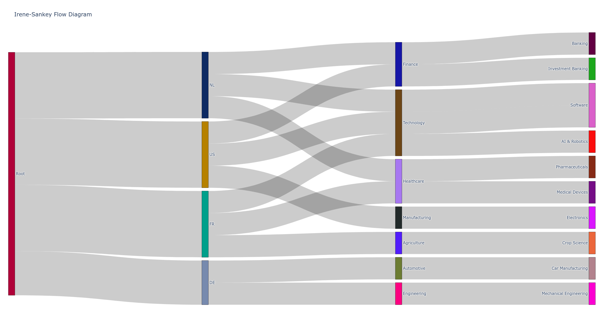

### Irene-Sankey Demo

Once the Irene-Sankey package is installed, you can use it in your projects. Here’s an example of how to use it: 

```py title="irene_sankey_demo.py" linenums="1"
import pandas as pd
from irene_sankey.core.traverse import traverse_sankey_flow
from irene_sankey.plots.sankey import plot_irene_sankey_diagram

# Sample data to test the functionality
df = pd.DataFrame(
    {
        "country": ["NL","NL","NL","DE","DE","FR","FR","FR","US","US","US"],
        "industry": [
            "Technology","Finance","Healthcare",
            "Automotive","Engineering",
            "Technology","Agriculture","Healthcare",
            "Manufacturing","Technology","Finance"],
        "field": [
            "Software","Banking","Pharmaceuticals",
            "Car Manufacturing","Mechanical Engineering",
            "Software","Crop Science","Medical Devices",
            "Electronics","AI & Robotics","Investment Banking"],
    }
)

# Generate source-target pair, node map and link for Sankey diagrams
flow_df, node_map, link = traverse_sankey_flow(df, ["", "country", "industry", "field"])

# Plot Sankey diagram 
fig = plot_irene_sankey_diagram(node_map, link, title = "Irene-Sankey Demo", node_config={
        "pad": 10,
        "line": dict(color="black", width=1),
    }
)
fig.show()
```

The output of the `traverse_sankey_flow` function provides three structured components that represent the flow of data for generating a Sankey diagram. Here’s what each component looks like:

=== "df"

    The input dataframe `df` for this demo:

    |  country|       industry|                   field|
    | ------- | ------------- | ---------------------- |
    |       NL|     Technology|                Software|
    |       NL|        Finance|                 Banking|
    |       NL|     Healthcare|         Pharmaceuticals|
    |       DE|     Automotive|       Car Manufacturing|
    |       DE|    Engineering|  Mechanical Engineering|
    |       FR|     Technology|                Software|
    |       FR|    Agriculture|            Crop Science|
    |       FR|     Healthcare|         Medical Devices|
    |       US|  Manufacturing|             Electronics|
    |       US|     Technology|           AI & Robotics|
    |       US|        Finance|      Investment Banking|

=== "flow_df"

    This dataframe that captures the flow relationships in the input dataframe `df`. It consists of five columns

    - **source** represents the label of the starting node for each flow.
    - **target** represents the label of the destination node for each flow.
    - **value** contains the count the records in each flow, indicating the weight of the connection from source to target.
    - **source_idx** represents the index of the starting node for each flow.
    - **target_idx** represents the index of the destination node for each flow.
    
    `flow_df` is the first output component in this demo: 


    |        source |                 target |value | source_idx | target_idx|
    | ------------- | ---------------------- | ---- | ---------- | --------- |
    |          Root |                     DE |    2 |          0 |          8|
    |          Root |                     FR |    3 |          0 |         13|
    |          Root |                     NL |    3 |          0 |          1|
    |          Root |                     US |    3 |          0 |         17|
    |            DE |             Automotive |    1 |          8 |          9|
    |            DE |            Engineering |    1 |          8 |         11|
    |            FR |            Agriculture |    1 |         13 |         14|
    |            FR |             Healthcare |    1 |         13 |          6|
    |            FR |             Technology |    1 |         13 |          2|
    |            NL |                Finance |    1 |          1 |          4|
    |            NL |             Healthcare |    1 |          1 |          6|
    |            NL |             Technology |    1 |          1 |          2|
    |            US |                Finance |    1 |         17 |          4|
    |            US |          Manufacturing |    1 |         17 |         18|
    |            US |             Technology |    1 |         17 |          2|
    |    Automotive |      Car Manufacturing |    1 |          9 |         10|
    |   Engineering | Mechanical Engineering |    1 |         11 |         12|
    |   Agriculture |           Crop Science |    1 |         14 |         15|
    |    Healthcare |        Medical Devices |    1 |          6 |         16|
    |    Technology |               Software |    1 |          2 |          3|
    |       Finance |                Banking |    1 |          4 |          5|
    |    Healthcare |        Pharmaceuticals |    1 |          6 |          7|
    |    Technology |               Software |    1 |          2 |          3|
    |       Finance |     Investment Banking |    1 |          4 |         21|
    | Manufacturing |            Electronics |    1 |         18 |         19|
    |    Technology |          AI & Robotics |    1 |          2 |         20|

=== "node_map"

    !!! note 
        This component is required to work directly with Plotly’s Sankey diagram functions.
        

    This dictionary maps each unique node (e.g., country, industry, or field) to an index:

    ```json
    {
        'Root': 0, 
        'NL': 1, 
        'Technology': 2, 
        'Software': 3, 
        'Finance': 4, 
        'Banking': 5, 
        'Healthcare': 6, 
        'Pharmaceuticals': 7, 
        'DE': 8, 
        'Automotive': 9, 
        'Car Manufacturing': 10, 
        'Engineering': 11, 
        'Mechanical Engineering': 12, 
        'FR': 13, 
        'Agriculture': 14, 
        'Crop Science': 15, 
        'Medical Devices': 16, 
        'US': 17, 
        'Manufacturing': 18, 
        'Electronics': 19, 
        'AI & Robotics': 20, 
        'Investment Banking': 21
    }
    ```

=== "link"

    !!! note 
        This component is required to work directly with Plotly’s Sankey diagram functions.


    This dictionary containing lists of indices that define the connections between nodes, formatted to work directly with Plotly’s Sankey diagram functions. It has three keys:

    - **source** A list of indices from node_map that represent the starting point of each flow.
    - **target** A list of indices from node_map representing the end point of each flow.
    - **value** A list of values matching each connection, indicating the flow strength.
  
    ```json
    {
        'source': [0, 0, 0, 0, 8, 8, 13, 13, 13, 1, 1, 1, 17, 17, 17, 9, 11, 14, 6, 2, 4, 6, 2, 4, 18, 2], 
        'target': [8, 13, 1, 17, 9, 11, 14, 6, 2, 4, 6, 2, 4, 18, 2, 10, 12, 15, 16, 3, 5, 7, 3, 21, 19, 20], 
        'value': [2, 3, 3, 3, 1, 1, 1, 1, 1, 1, 1, 1, 1, 1, 1, 1, 1, 1, 1, 1, 1, 1, 1, 1, 1, 1]
    }

    ```

=== "Sankey Plot"

    { width=800 }

  [Irene-Sankey]: https://pypi.org/project/irene-sankey/
  [virtual environment]: https://realpython.com/what-is-pip/#using-pip-in-a-python-virtual-environment